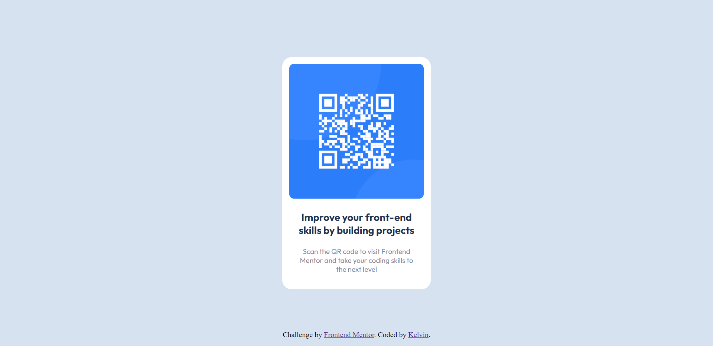

# Frontend Mentor - QR code component solution

This is a solution to the [QR code component challenge on Frontend Mentor](https://www.frontendmentor.io/challenges/qr-code-component-iux_sIO_H). Frontend Mentor challenges help you improve your coding skills by building realistic projects. 

## Table of contents

- [Overview](#overview)
  - [Screenshot](#screenshot)
- [My process](#my-process)
  - [Built with](#built-with)
  - [What I learned](#what-i-learned)
- [Author](#author)

## Overview

### Screenshot



## My process

### Built with

- HTML

### What I learned

In this challenge I learned how to position an element to be in the center of the page.

To see how you can add code snippets, see below:

 position: absolute;
      top: 0;
      bottom: 0;
      left: 0;
      right: 0;
      margin: auto;
```html
<div></div>
```
```css
div {
  width: 100px;
  height: 100px;
  background-color: red;

  position: absolute;
  top:0;
  bottom: 0;
  left: 0;
  right: 0;
  
  margin: auto;
}
```

## Author

- Frontend Mentor - [@Ryostic](https://www.frontendmentor.io/profile/Ryostic)
- Instagram - [@kelv1nn__](https://www.instagram.com/kelv1nn__)